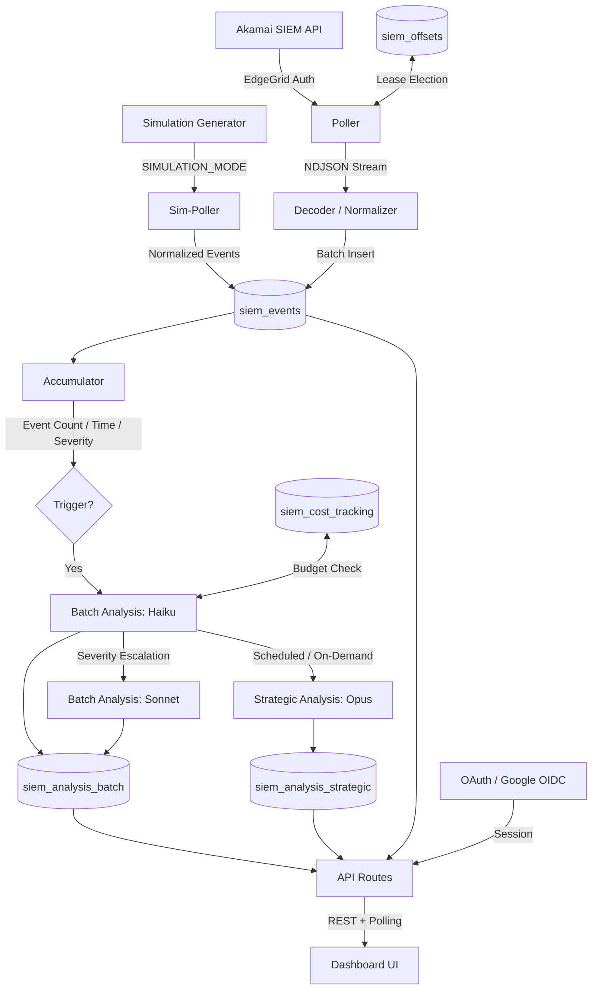

# Akamai SIEM Analyzer

Real-time Akamai security event ingestion and AI-powered threat analysis, built as a [Harper](https://harper.fast) component.

## Overview

Akamai SIEM Analyzer ingests security event logs from **Akamai Account Protector** (with **Bot Manager Premier**), stores them with configurable TTL, and runs **tiered AI analysis** using Anthropic's Claude models. A streaming dashboard gives security analysts real-time visibility into threats, attack patterns, and policy effectiveness.

### Key Capabilities

- **Continuous ingestion** via Akamai SIEM API with offset-based polling and automatic recovery
- **Tiered AI analysis** with adaptive model escalation:
  - **Batch analysis (Haiku → Sonnet)**: Per-batch severity classification, escalates to Sonnet when severity indicators are present
  - **Strategic analysis (Opus)**: On-demand or scheduled cross-batch trend analysis and campaign detection
- **Adaptive triggering**: Analysis triggers based on event count, time ceiling, or severity escalation
- **Cluster-safe**: Lease-based leader election ensures single-writer polling across Harper cluster nodes
- **Cost management**: Per-model token tracking with daily budget warnings and hard caps
- **Dark-themed SOC dashboard** with severity-colored analysis cards, IP drilldown, and event lightbox

## Architecture



### Data Flow

1. **Ingestion**: The poller fetches events from Akamai's SIEM API using EdgeGrid authentication, decodes base64-encoded attack data, normalizes fields, and batch-inserts into Harper with deterministic IDs for idempotent upserts.

2. **Analysis**: An accumulator buffers event metadata across poll cycles. When thresholds are crossed (event count, time ceiling, or severity escalation), batch analysis runs via Haiku. If severity indicators are elevated, the batch model escalates to Sonnet. Strategic analysis (Opus) runs on a daily schedule or on-demand from the dashboard, consuming structured batch summaries and pre-computed trends for cross-batch pattern detection.

3. **Delivery**: The dashboard polls API endpoints to display severity-colored analysis cards with clickable IP and event references. Analysts can drill down into individual events, query by IP/path/country, and trigger on-demand strategic analysis.

## Harper Capabilities Used

| Capability | Usage |
|-----------|-------|
| **Component Architecture** | Runs as a Harper component (Node.js runtime on HarperDB) |
| **GraphQL Schema** | Declarative table definitions with `@table`, `@indexed`, `@primaryKey`, `@export` |
| **Record Expiration/Eviction** | `@table(expiration: N)` for automatic TTL-based cleanup — 7d events, 90d batch analysis, 180d strategic, 24h exports |
| **Native Date Type** | `Date` with `@createdTime` auto-population |
| **Blob Storage** | Profile pictures (via `createBlob`) and export files stored directly in tables |
| **Audit Logging** | `@table(audit: true)` on the runtime configuration table |
| **Relationships** | `@relationship(from:)` for cross-table User lookups |
| **Resource Classes** | Custom REST endpoints (`Api`, `Analysis`, `Events`, etc.) and table resources with `allowRead` access control |
| **OAuth Plugin** | `@harperfast/oauth` with Google OIDC for session-based authentication |
| **Cluster-Safe Polling** | Lease-based leader election via `siem_offsets` table |

## Assumptions & Prerequisites

- **HarperDB v4.7+** installed (`npm install -g harperdb`)
- **Node.js v20+**
- **Akamai SIEM API access** — Account Protector license with SIEM Integration enabled
- **Akamai EdgeGrid credentials** — client token, client secret, access token, and host
- **Anthropic API key** — with access to Claude Haiku, Sonnet, and Opus models
- **Google Cloud OAuth 2.0 credentials** — client ID and secret with authorized redirect URIs (`http://localhost:9926/oauth/google/callback` for local dev, `https://<project>.<org>.harperfabric.com/oauth/google/callback` for Fabric — no port number)

## Setup

### 1. Install dependencies

```sh
npm install
```

### 2. Configure Fabric credentials

Run the interactive login helper to securely create your `.env` file with your Harper Fabric cluster credentials:

```sh
npm run login
```

This will prompt for your Cluster URL, Username, and Password and write them to `.env` — no credentials in your shell history.

### 3. Add remaining environment variables

Open `.env` and add the remaining configuration values:

```sh
# Akamai EdgeGrid
AKAMAI_HOST=your-host.luna.akamaiapis.net
AKAMAI_CLIENT_TOKEN=your-client-token
AKAMAI_CLIENT_SECRET=your-client-secret
AKAMAI_ACCESS_TOKEN=your-access-token
AKAMAI_CONFIG_ID=your-config-id

# Anthropic
ANTHROPIC_API_KEY=sk-ant-...

# Google OAuth
OAUTH_GOOGLE_CLIENT_ID=your-client-id.apps.googleusercontent.com
OAUTH_GOOGLE_CLIENT_SECRET=your-client-secret
OAUTH_REDIRECT_URI=http://localhost:9926/oauth/google/callback
```

| Variable | Description |
|----------|-------------|
| `AKAMAI_HOST` | Akamai EdgeGrid API hostname |
| `AKAMAI_CLIENT_TOKEN` | EdgeGrid client token |
| `AKAMAI_CLIENT_SECRET` | EdgeGrid client secret |
| `AKAMAI_ACCESS_TOKEN` | EdgeGrid access token |
| `AKAMAI_CONFIG_ID` | Akamai security configuration ID to poll |
| `ANTHROPIC_API_KEY` | Anthropic API key |
| `OAUTH_GOOGLE_CLIENT_ID` | Google OAuth 2.0 client ID |
| `OAUTH_GOOGLE_CLIENT_SECRET` | Google OAuth 2.0 client secret |
| `OAUTH_REDIRECT_URI` | OAuth callback URL (no port for Fabric HTTPS) |

### 4. Start development server

```sh
npm run dev
```

Open [http://localhost:9926](http://localhost:9926) to access the dashboard.

### 5. Configure analysis (optional)

Runtime defaults are in `config/default.json`. Key tunables:

| Setting | Default | Description |
|---------|---------|-------------|
| `ingestion.pollIntervalSeconds` | 30 | Seconds between poll cycles |
| `analysis.batch.eventCountThreshold` | 500 | Events before triggering batch analysis |
| `analysis.batch.timeCeilingSeconds` | 300 | Max seconds before forcing analysis |
| `analysis.strategic.intervalHours` | 24 | Strategic analysis interval |
| `cost.dailyBudgetWarningUSD` | 5.00 | Daily cost warning threshold |
| `cost.dailyBudgetHardCapUSD` | 10.00 | Daily cost hard cap (halts analysis, not ingestion) |

## API Reference

Resource URLs are **case-sensitive** and match the exported class name.

| Endpoint | Method | Auth | Description |
|----------|--------|------|-------------|
| `/Api/me` | GET | public | Current user profile (returns `authenticated: false` if not logged in) |
| `/Api/health` | GET | analyst+ | System health, poller status, and cost summary |
| `/Api/cost` | GET | admin | Daily cost breakdown |
| `/Api/logout` | POST | analyst+ | Destroy session |
| `/Analysis/stream` | GET | analyst+ | Recent analyses (polling endpoint) |
| `/Analysis/{id}` | GET | analyst+ | Analysis detail |
| `/Analysis/` | POST | admin | Trigger on-demand strategic analysis |
| `/Events/{id}` | GET | analyst+ | Event detail |
| `/Events/query` | POST | analyst+ | Query events by IP, path, country, action |
| `/Events/export` | POST | analyst+ | Export events (NDJSON or CSV) |
| `/EventBatch/{batchId}` | GET | analyst+ | Events by batch |
| `/ExportStatus/{id}` | GET | analyst+ | Export status |
| `/Config/{key}` | GET/PUT | admin | Read/update runtime configuration |
| `/UserPicture/{userId}` | GET | analyst+ | User avatar blob |
| `/Simulation/status` | GET | sim mode | Auto-generator state and pending events |
| `/Simulation/auto-start` | POST | sim mode | Start continuous event generation |
| `/Simulation/auto-stop` | POST | sim mode | Stop the auto-generator |
| `/Simulation/generate` | POST | sim mode | Generate a one-shot event batch |
| `/Simulation/clear` | POST | sim mode | Delete pending simulated events |
| `/oauth/google/login` | GET | public | Initiate Google OAuth login |
| `/oauth/google/callback` | GET | public | OAuth callback (handled by plugin) |

## Simulation Mode

Run the full analysis pipeline without Akamai credentials — ideal for demos, testing, and development.

### Quick Start

1. Set `SIMULATION_MODE=true` in `.env` (no Akamai credentials needed, `ANTHROPIC_API_KEY` still required)
2. Start the server: `npm run dev` or `npm run deploy`
3. Log in via the dashboard
4. Start event generation:

```sh
# Start the auto-generator (credential stuffing escalation scenario)
curl -X POST http://localhost:9926/Simulation/auto-start \
  -H "Content-Type: application/json" \
  -d '{"intervalSeconds": 25, "eventsPerCycle": 10, "scenario": "credential_stuffing"}'
```

Events will flow through the standard pipeline: simulated events → normalizer → accumulator → AI analysis. Batch analysis triggers every ~30 seconds in simulation mode (vs 5 minutes in production).

### Simulation API

| Endpoint | Method | Description |
|----------|--------|-------------|
| `/Simulation/status` | GET | Auto-generator state and pending event count |
| `/Simulation/auto-start` | POST | Start continuous event generation |
| `/Simulation/auto-stop` | POST | Stop the auto-generator |
| `/Simulation/generate` | POST | Generate a one-shot batch of events |
| `/Simulation/clear` | POST | Delete all pending simulated events |

### Attack Scenarios

| Scenario | Description |
|----------|-------------|
| `credential_stuffing` | Login endpoint attacks with persistent botnet IPs (default, auto-escalates over ~20 min) |
| `sqli` | SQL injection attempts on API endpoints |
| `xss` | Cross-site scripting with script tags and event handlers |
| `path_traversal` | Directory traversal attempts (`../`, `/etc/passwd`) |
| `bot_scanner` | Automated scanning (robots.txt, .git, wp-admin) |
| `clean` | Normal traffic with no violations |
| `mixed` / `light` / `heavy` / `peak` | Weighted blends of the above at varying intensities |

### Escalation Timeline (credential_stuffing)

The auto-generator progresses through 5 phases to simulate a realistic attack:

| Phase | Time | Intensity | What happens |
|-------|------|-----------|--------------|
| 1 | 0–3 min | Light | Background traffic, low deny ratio |
| 2 | 3–7 min | Mixed | First probes, deny ratio climbs |
| 3 | 7–15 min | Heavy | Full campaign, 1.5x event volume |
| 4 | 15–20 min | Peak | Maximum intensity, 2x volume |
| 5 | 20+ min | Taper | Attack subsides, elevated baseline |

## Cost Management

AI analysis costs are tracked per-model in the `siem_cost_tracking` table:

- **Budget warning** fires at the configured threshold (default $5/day)
- **Hard cap** halts all AI analysis (not ingestion) at the configured limit (default $10/day)
- **Prompt caching** reduces cost for repeated batch analysis calls (stable system prompt cached)
- **Adaptive model selection** uses Haiku by default, only escalating to Sonnet/Opus when warranted

## Testing

```sh
npm test
```

65 tests covering:
- Attack data decoding (base64, URL encoding, malformed input, `+` preservation)
- Event normalization (field mapping, deterministic ID generation)
- Accumulator trigger logic (event count, time ceiling, severity escalation)
- Simulation event generator (structure, scenarios, campaign IPs, score ranges)
- Auto-generator escalation phases (timing, transitions, event count scaling)
- Cost calculation (per-model pricing, budget thresholds, spend derivation)
- Strategic trend computation and prompt construction

## Deployment

1. Create a cluster at [https://fabric.harper.fast/](https://fabric.harper.fast/)
2. Run `npm run login` to configure `.env` with cluster credentials
3. Set `OAUTH_REDIRECT_URI` in `.env` to `https://<project>.<org>.harperfabric.com/oauth/google/callback` (no port number for Fabric HTTPS)
4. Add the Fabric redirect URI to your Google Cloud OAuth consent screen
5. Deploy:

```sh
npm run deploy
```

The deploy script uses `dotenv` to load `.env` and runs `harper deploy_component` with rolling restart and replication enabled.

## License

Private — HarperFast
