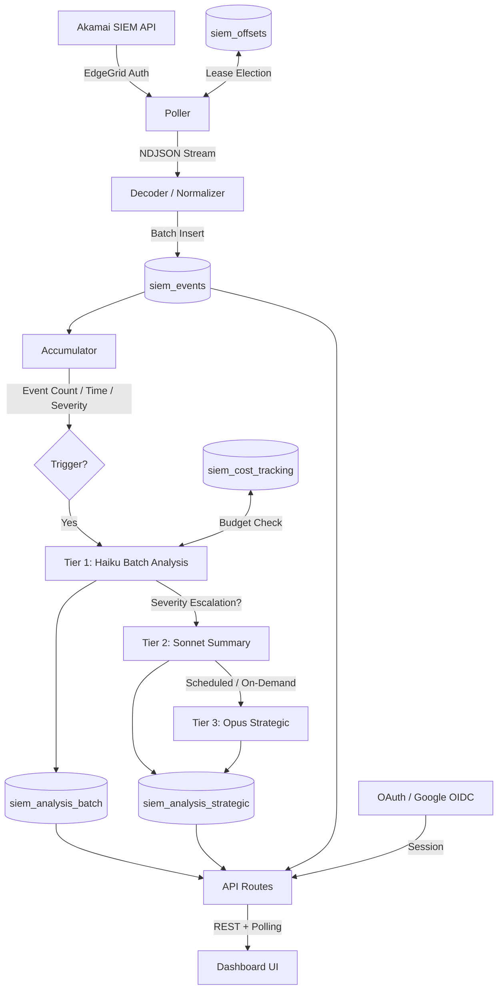

# Akamai SIEM Analyzer

Real-time Akamai security event ingestion and AI-powered threat analysis, built as a [Harper](https://harperdb.io) component.

## Overview

Akamai SIEM Analyzer ingests security event logs from **Akamai Account Protector** (with **Bot Manager Premier**), stores them with configurable TTL, and runs **tiered AI analysis** using Anthropic's Claude models. A streaming dashboard gives security analysts real-time visibility into threats, attack patterns, and policy effectiveness.

### Key Capabilities

- **Continuous ingestion** via Akamai SIEM API with offset-based polling and automatic recovery
- **Tiered AI analysis** with adaptive model escalation:
  - **Tier 1 (Haiku)**: Per-batch analysis with severity classification
  - **Tier 2 (Sonnet)**: Hourly cross-batch trend summaries
  - **Tier 3 (Opus)**: Daily strategic assessments and campaign detection
- **Adaptive triggering**: Analysis triggers based on event count, time ceiling, or severity escalation
- **Cluster-safe**: Lease-based leader election ensures single-writer polling across Harper cluster nodes
- **Cost management**: Per-model token tracking with daily budget warnings and hard caps
- **Dark-themed SOC dashboard** with severity-colored analysis cards, IP drilldown, and event lightbox

## Architecture



### Data Flow

1. **Ingestion**: The poller fetches events from Akamai's SIEM API using EdgeGrid authentication, decodes base64-encoded attack data, normalizes fields, and batch-inserts into Harper with deterministic IDs for idempotent upserts.

2. **Analysis**: An accumulator buffers event metadata across poll cycles. When thresholds are crossed (event count, time ceiling, or severity escalation), batch analysis runs via Haiku. If severity indicators are elevated, the model escalates to Sonnet. Hourly summaries (Sonnet) and daily strategic assessments (Opus) run on schedule.

3. **Delivery**: The dashboard polls API endpoints to display severity-colored analysis cards with clickable IP and event references. Analysts can drill down into individual events, query by IP/path/country, and trigger on-demand strategic analysis.

## Harper Capabilities Used

| Capability | Usage |
|-----------|-------|
| **Component Architecture** | Runs as a Harper component (Node.js runtime on HarperDB) |
| **GraphQL Schema** | Declarative table definitions with `@table`, `@indexed`, `@primaryKey`, `@export` |
| **Record Expiration/Eviction** | `@table(expiration: N)` for automatic TTL-based cleanup — 7d events, 90d batch analysis, 180d strategic, 24h exports |
| **Native Date Type** | `Date` with `@createdTime` / `@updatedTime` auto-population |
| **Blob Storage** | Profile pictures and export files stored directly in tables via `createBlob` |
| **Audit Logging** | `@table(audit: true)` on the runtime configuration table |
| **Relationships** | `@relationship(from:)` for cross-table User lookups |
| **Resource Classes** | Custom REST endpoints with `allow*` access control methods |
| **OAuth Plugin** | `@harperfast/oauth` with Google OIDC for session-based authentication |
| **Cluster-Safe Polling** | Lease-based leader election via `siem_offsets` table |

## Assumptions & Prerequisites

- **HarperDB v4.7+** installed (`npm install -g harperdb`)
- **Node.js v20+**
- **Akamai SIEM API access** — Account Protector license with SIEM Integration enabled
- **Akamai EdgeGrid credentials** — client token, client secret, access token, and host
- **Anthropic API key** — with access to Claude Haiku, Sonnet, and Opus models
- **Google Cloud OAuth 2.0 credentials** — client ID and secret with authorized redirect URI (`http://localhost:9926/oauth/google/callback` for local dev)

## Setup

### 1. Install dependencies

```sh
npm install
```

### 2. Configure environment

Copy `.env.example` to `.env` and fill in your credentials:

```sh
cp .env.example .env
```

| Variable | Description |
|----------|-------------|
| `AKAMAI_HOST` | Akamai EdgeGrid API hostname |
| `AKAMAI_CLIENT_TOKEN` | EdgeGrid client token |
| `AKAMAI_CLIENT_SECRET` | EdgeGrid client secret |
| `AKAMAI_ACCESS_TOKEN` | EdgeGrid access token |
| `AKAMAI_CONFIG_ID` | Akamai security configuration ID to poll |
| `ANTHROPIC_API_KEY` | Anthropic API key |
| `OAUTH_GOOGLE_CLIENT_ID` | Google OAuth 2.0 client ID |
| `OAUTH_GOOGLE_CLIENT_SECRET` | Google OAuth 2.0 client secret |

### 3. Start development server

```sh
npm run dev
```

Open [http://localhost:9926](http://localhost:9926) to access the dashboard.

### 4. Configure analysis (optional)

Runtime defaults are in `config/default.json`. Key tunables:

| Setting | Default | Description |
|---------|---------|-------------|
| `ingestion.pollIntervalSeconds` | 30 | Seconds between poll cycles |
| `analysis.batch.eventCountThreshold` | 500 | Events before triggering batch analysis |
| `analysis.batch.timeCeilingSeconds` | 300 | Max seconds before forcing analysis |
| `analysis.summary.intervalMinutes` | 60 | Summary analysis interval |
| `analysis.strategic.intervalHours` | 24 | Strategic analysis interval |
| `cost.dailyBudgetWarningUSD` | 5.00 | Daily cost warning threshold |
| `cost.dailyBudgetHardCapUSD` | 10.00 | Daily cost hard cap (halts analysis, not ingestion) |

## API Reference

| Endpoint | Method | Auth | Description |
|----------|--------|------|-------------|
| `/api/analysis/stream` | GET | analyst+ | Recent analyses (polling endpoint) |
| `/api/analysis/on-demand` | POST | admin | Trigger strategic analysis |
| `/api/analysis/{id}` | GET | analyst+ | Analysis detail |
| `/api/events/{id}` | GET | analyst+ | Event detail |
| `/api/events/batch/{batchId}` | GET | analyst+ | Events by batch |
| `/api/events/query` | POST | analyst+ | Query events by IP, path, country, action |
| `/api/events/export` | POST | analyst+ | Export events (NDJSON or CSV) |
| `/api/events/export/{id}` | GET | analyst+ | Export status |
| `/api/health` | GET | analyst+ | System health and poller status |
| `/api/cost` | GET | admin | Daily cost breakdown |
| `/api/config/{key}` | PUT | admin | Update runtime configuration |
| `/api/me` | GET | analyst+ | Current user profile |

## Cost Management

AI analysis costs are tracked per-model in the `siem_cost_tracking` table:

- **Budget warning** fires at the configured threshold (default $5/day)
- **Hard cap** halts all AI analysis (not ingestion) at the configured limit (default $10/day)
- **Prompt caching** reduces cost for repeated batch analysis calls (stable system prompt cached)
- **Adaptive model selection** uses Haiku by default, only escalating to Sonnet/Opus when warranted

## Testing

```sh
npm test
```

Tests cover:
- Attack data decoding (base64, URL encoding, malformed input, `+` preservation)
- Event normalization (field mapping, deterministic ID generation)
- Accumulator trigger logic (event count, time ceiling, severity escalation)

## Deployment

1. Create a cluster at [https://fabric.harper.fast/](https://fabric.harper.fast/)
2. Configure `.env` with cluster credentials (`CLI_TARGET`, `CLI_TARGET_USERNAME`, `CLI_TARGET_PASSWORD`)
3. Deploy:

```sh
npm run deploy
```

## License

Private — HarperFast
